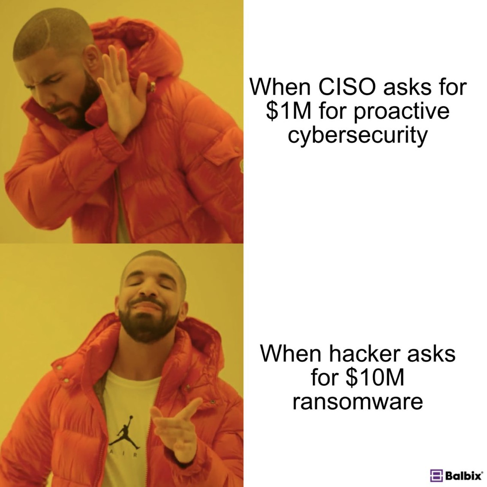

# Security

The Security must be proportional to the Potential Threat and the Potential Threat can be derived from the Criminal Energy, which might be unlocked by the Potential Reward w/in the context of the Chance of Discovery and Potential Punishment.

## Personal

### Bravery 

Failire of IT is not always technology failure of IT—it is sometimes budget failure of the CEO/CFO. In these cases the failure of IT (CTO) is a failure of bravery—that they have not fought or resigned.

_h/t Roy Long_

### Minimalist

The less software you have on your computer, the less bad things can happen to you.

### Password

A string login password protects you in more than one way.

### Strong Passwords

Passwords you do not need to write down are the best.

A way to remember such complex passwords is a simple set of rules. For example your favourite poem, where you get the first letter from the first word, the second letter from the second word, etc. You go like this for 12 words. If a letter is a first letter, it it a capital. If a word has less letters, you wrap from the beginning. At the end you add your age and an exclamation mark.

### 2FA

Always enforce 2FA.

MFA is actually less secure.

### Screen Lock

Do not leave your computer unlocked.

It's not only security: someone may accidentally press a key and accidentally send this unfinished email or delete something.

### Screen Saver

For when you forget to lock your screen.

### Screen Protector

Reduce the visual angle from which the screen can be read.

### Wall Behind Your Back

Self-explanatory.

### Anti-Malware/ Firewall

Some OSes have a built-in one.

Sometimes you should add.

Stealth mode.

### Encrypted HDD/ SSD

For when you lose your computer or it gets stolen.

### Backup w/ Infinite Versioning

For many reasons.

Ransomware is real.

## Organisational

### Background Checks

Are your people who they say they are?

* Criminal Record?
* Check of Facts (Contact previous employees, universities, schools)

There are organisations who do background checks as a service.

### Firewall

### Anti-Mallware

### Central Directory and SSO

A user can be fully deactivated at one single place.

### IP whitelisting

Your people must VPN into your office and only from there elsewhere.

### Jump/ Bastion Servers

DevOps can do System Work only from specially appointed machines w/ continuous screen/ keyboard capture.

### USB Ports

## Technology

### Kubernetes

See Kubernetes [Security](https://github.com/dahoum/Nursery/blob/master/Kubernetes/README.md#security).

## Incidents

[Swedish Coop supermarkets shut due to US ransomware cyber-attack](https://www.bbc.com/news/technology-57707530), 3 July 2021

